# Use JMS Resource Health

## Introduction  
This appendix walks you through the steps to use Java Management Service (JMS) Resource Health to monitor the health of Java resources.
JMS Resource Health provides a comprehensive list of issues affecting JMS Fleets and a JMS plug-in. It identifies and reports the following types of issues:

For JMS Fleets:
- Fleets that don't have any managed instances.
- JMS plug-in registered to a fleet that encounter errors while attempting to push inventory data to the fleet inventory or operational logs, likely due to missing policies.

For a JMS Plug-in:
- JMS plug-in in instances that cannot register with JMS Fleets due to a missing policy.
- JMS plug-in in instances that encounter errors while attempting to push inventory data to the fleet inventory or operational logs, likely due to missing policies.
- JMS plug-in in instances not associated with any fleet, which may occur if the JMS plug-in is enabled under OCA but registration hasn't been completed.

Estimated Time: 5 minutes

### Objectives
In this lab, you will:
- Access the JMS Resource Health dashboard
- Troubleshoot JMS Fleet Health Issues
- Troubleshoot JMS Plug-in Health Issues

## Task 1: View Resource Health

1. In the Oracle Cloud Console, open the navigation menu, click **Observability & Management**, and then click **Health** under **Java Management**.

    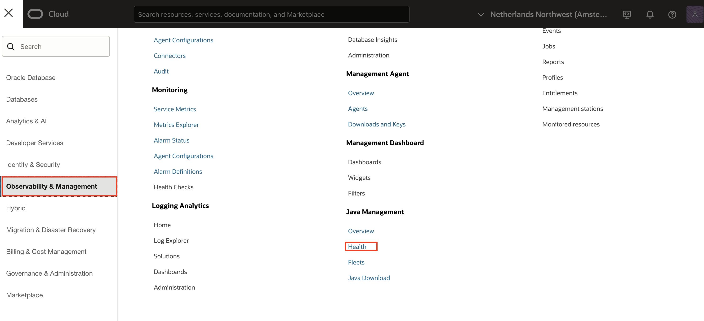

2. Detailed information of the resources with issues in the selected compartment will be displayed.

    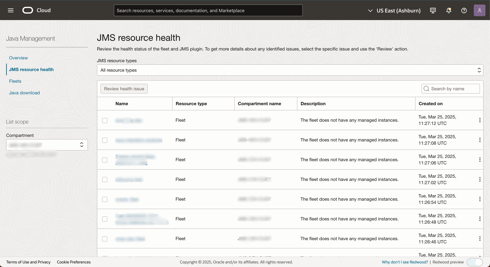

3. You can filter the displayed information based on resource type.

    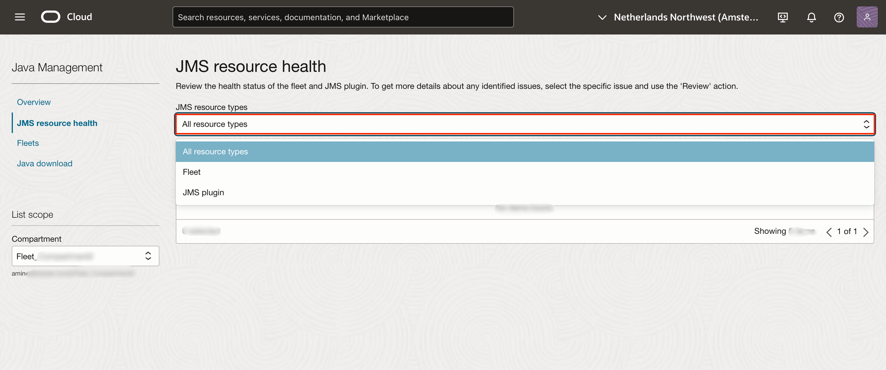

## Task 2: Troubleshoot JMS Fleet Health Issue

1. Click the action menu and select **Review health** issue option to resolve the issue related to the selected fleet.

    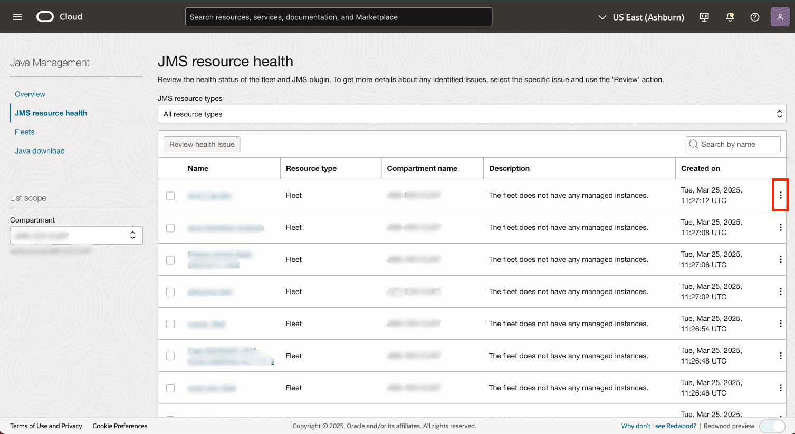

2. You can resolve the issue related to the fleet selected using one of the recommended options:
    * Use the OMA installer provided by JMS or installation script to install agents and deploy the JMS plug-in on hosts you want to monitor within the fleet.

        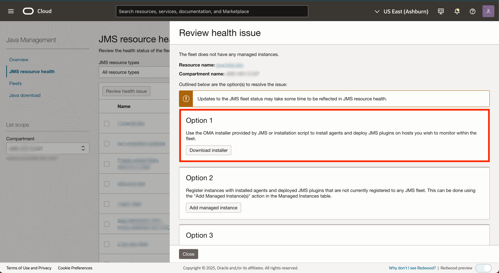

    * Register OCI instances with installed agents and the deployed JMS plug-in that aren't currently registered to any JMS fleet.

        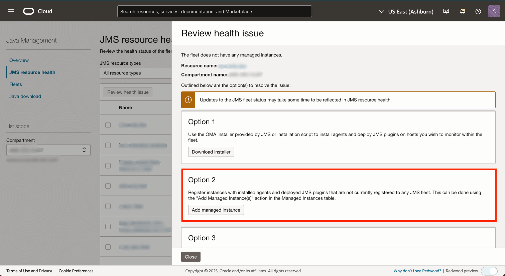

    * If the fleet is no longer needed, delete it.

        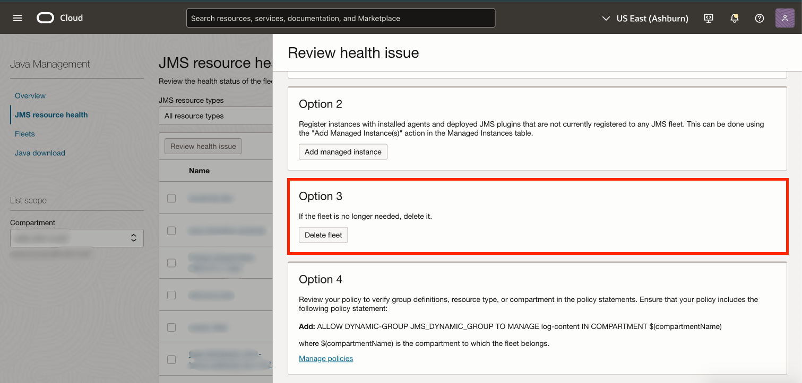

    * Review your policy to verify group definitions, resource type, or compartment in the policy statements.

        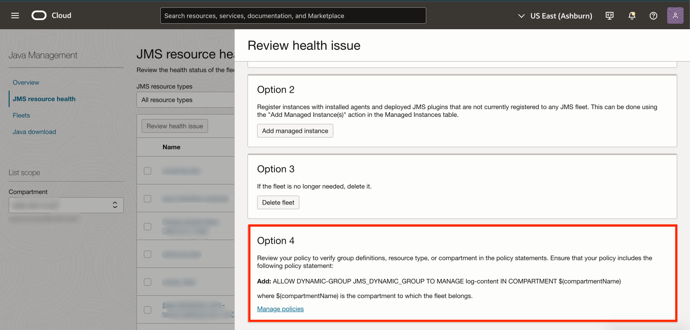

## Task 3: Troubleshoot JMS Plug-in Health Issue

1. Click the action menu and select **Review health** issue option to resolve the issue related to the selected plug-in.

    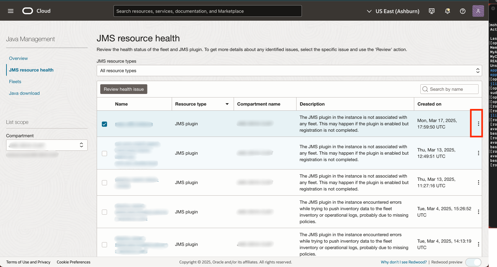

2. You can resolve the issue related to the plug-in selected using one of the recommended options:
    * Complete the registration of the JMS plug-in to the fleet. Use the Add Managed Instance action in the Managed instance table of the fleet.

        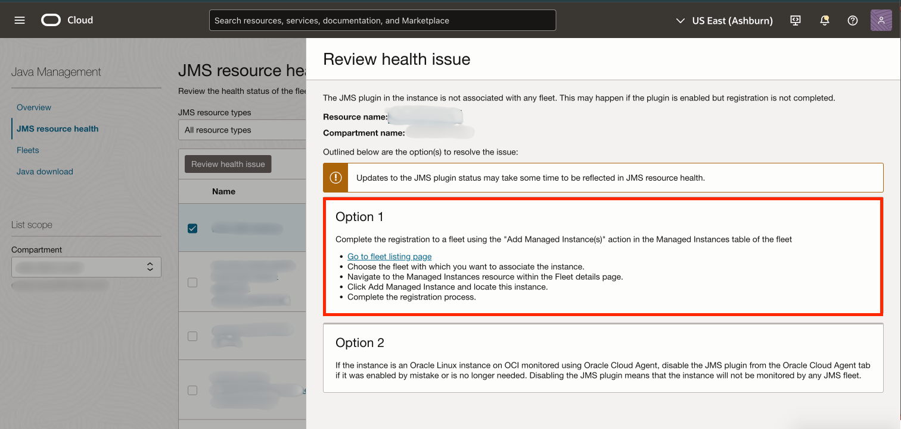

    * Disable the plug-in from the Oracle Cloud Agent tab if it was enabled by mistake or is no longer needed.

        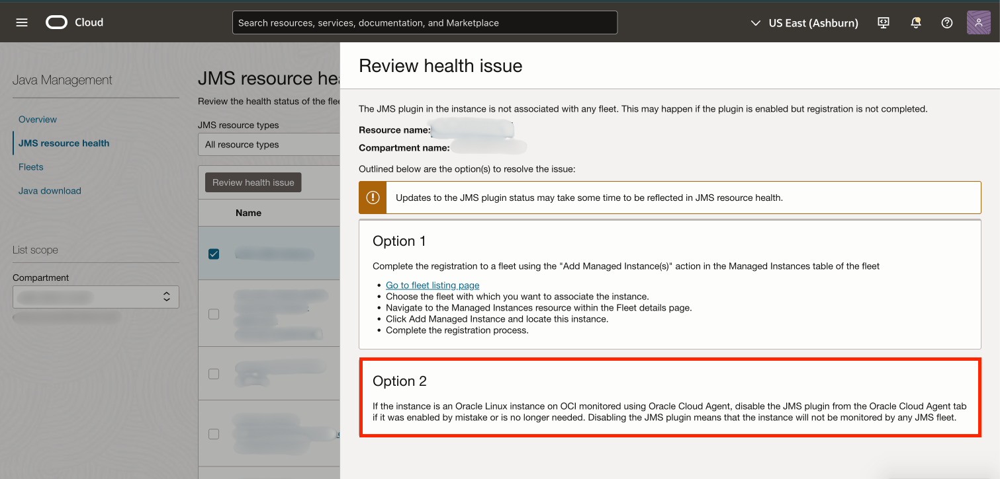

---

## Learn More

* Refer to the [JMS Resource Health](https://docs.oracle.com/en-us/iaas/jms/doc/resource-health.html) section of the JMS documentation for more details.

* If the problem still persists or it is not listed, then refer to the [Getting Help and Contacting Support](https://docs.oracle.com/en-us/iaas/Content/GSG/Tasks/contactingsupport.htm) section. You can also open a support service request using the **Help** menu in the OCI console.

## Acknowledgements

* **Author** - El Khaider Amine, Java Management Service
* **Last Updated By** - El Khaider Amine, March 2025
